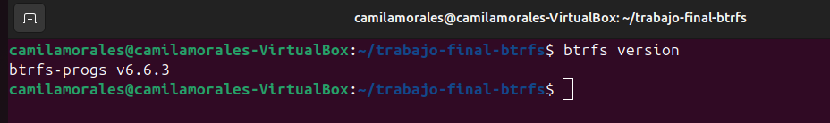
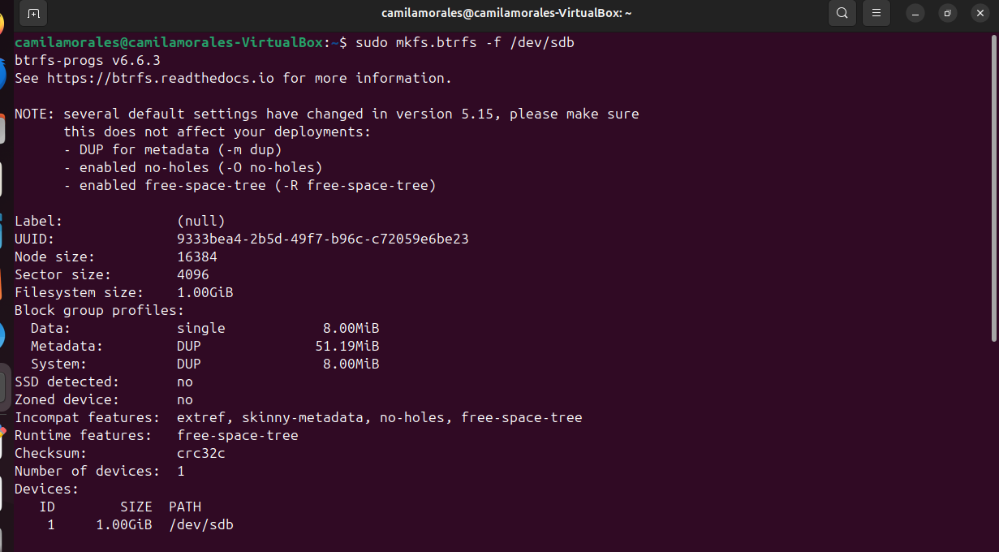
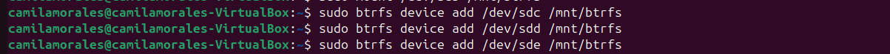
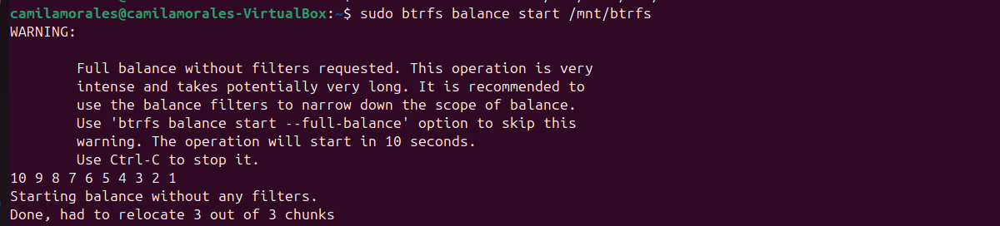
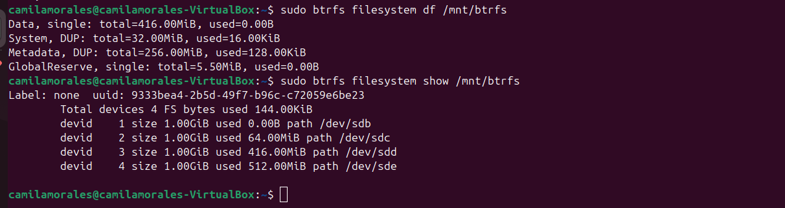

# Instalación de BtrFS

En esta sección se documenta la instalación y verificación de BtrFS en la máquina virtual Ubuntu Desktop 24.04.

## Verificación de la instalación

BtrFS ya venía instalado en la máquina virtual. Para confirmar si está instalado, se puede ejecutar:

```bash
btrfs version
```

Resultado obtenido:

```text
btrfs-progs v6.6.3
```


La salida confirma que BtrFS se encuentra instalado y disponible para su utilización en el sistema.

## Instalación en caso de no estar presente en el sistema

En caso de que BtrFS no este instalado, podría instalarse con los siguientes comandos:

```bash
sudo apt update
sudo apt install btrfs-progs
```

Una vez finalizada la instalación, se puede volver a ejecutar el comando `btrfs version` para verificar que el paquete fue instalado correctamente.

## Creación del filesystem BtrFS

Para iniciar, se formateó el primer disco virtual (`/dev/sdb`) con el objetivo de permitir un entorno controlado para la creación de snapshots y pruebas de restauración.

```bash
sudo mkfs.btrfs -f /dev/sdb
```


## Montaje del filesystem

Se crea un punto de montaje y se monta el filesystem con los comandos:

```bash
sudo mkdir -p /mnt/btrfs
sudo mount /dev/sdb /mnt/btrfs 
```


## Se agregan los discos restantes al pool

Se agregan los discos restantes al pool BtrFS para aumentar la capacidad del filesystem con los comandos:

```bash
sudo btrfs device add /dev/sdc /mnt/btrfs
sudo btrfs device add /dev/sdd /mnt/btrfs
sudo btrfs device add /dev/sde /mnt/btrfs
```


## Balanceo del filesystem

Se realiza un balanceo completo para distribuir uniformemente los datos y metadatos entre los discos:

```bash
sudo btrfs balance start /mnt/btrfs
```


Este proceso puede tardar dependiendo del tamaño y la cantidad de dispositivos.

## Verificación del estado del filesystem

Se verifica el estado del pool y el uso de los discos con los comandos:

```bash
sudo btrfs filesystem df /mnt/btrfs
sudo btrfs filesystem show /mnt/btrfs
```


## Justificación

Se decidió crear inicialmente el filesystem sobre un único disco para simplificar la configuración y las pruebas de snapshots, subvolúmenes y restauración de datos. Una vez verificado su funcionamiento, se agregaron los demás discos al pool de BtrFS para demostrar su capacidad de expansión sobre múltiples dispositivos.

Luego, se realizó un balanceo para distribuir los datos entre todos los discos incorporados y aprovechar mejor el espacio disponible.

No se utilizó RAID, ya que el objetivo principal del trabajo era analizar las funcionalidades de BtrFS relacionadas con snapshots, cuotas y recuperación de datos, manteniendo una configuración sencilla que facilitara las pruebas y la observación de resultados.

## Preparación para la siguiente etapa

Con el filesystem ya creado y expandido a múltiples dispositivos, el entorno queda listo para la creación de subvolúmenes, snapshots y la demostración de restauración de datos.
