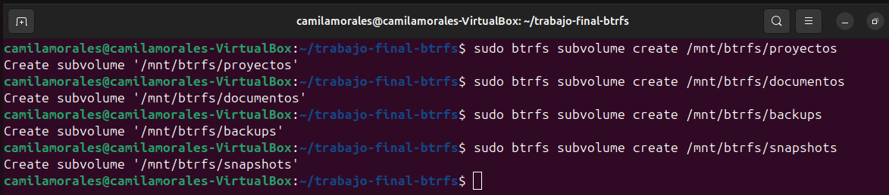
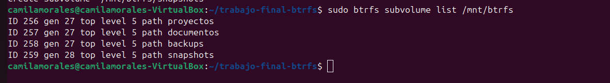
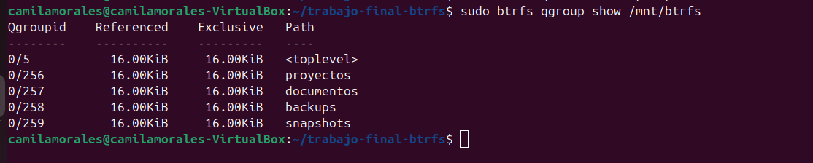
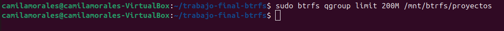
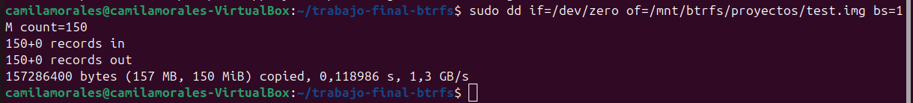
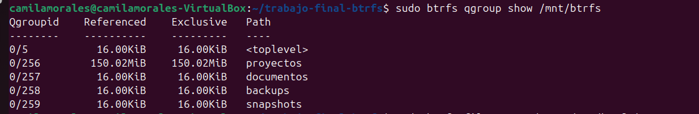

# Subvolúmenes y Cuotas

## Introducción

Una de las características más importantes de BtrFS es la posibilidad de dividir un mismo filesystem en múltiples subvolúmenes independientes, facilitando la organización de datos y la creación de snapshots.

Además, BtrFS permite configurar cuotas de almacenamiento para controlar el espacio utilizado por cada subvolumen.

## Creación de subvolúmenes

Para organizar el almacenamiento dentro del filesystem se crearon cuatro subvolúmenes con diferentes propósitos:

| Subvolumen | Función |
|------------|----------|
| proyectos | Utilizado para realizar las pruebas principales del trabajo. |
| documentos | Utilizado para demostrar la administración de múltiples subvolúmenes. |
| backups | Destinado a almacenar copias de seguridad y pruebas con `btrfs send` y `btrfs receive`. |
| snapshots | Utilizado para almacenar los snapshots generados durante el proyecto. |

Los comandos utilizados fueron:

```bash
sudo btrfs subvolume create /mnt/btrfs/proyectos
sudo btrfs subvolume create /mnt/btrfs/documentos
sudo btrfs subvolume create /mnt/btrfs/backups
sudo btrfs subvolume create /mnt/btrfs/snapshots
```



## Verificación de los subvolúmenes

Para comprobar la creación correcta de los subvolúmenes se ejecutó:

```bash
sudo btrfs subvolume list /mnt/btrfs
```

Resultado:

```text
ID 256 path proyectos
ID 257 path documentos
ID 258 path backups
ID 259 path snapshots
```



Cada subvolumen recibió un identificador único dentro del filesystem BtrFS.

## Habilitación de cuotas

BtrFS permite controlar el uso de espacio mediante grupos de cuotas (Quota Groups o qgroups). Para habilitar esta funcionalidad se ejecutó:

```bash
sudo btrfs quota enable /mnt/btrfs
```


Luego de habilitar las cuotas, se verificó la creación de los grupos de cuotas mediante el comando:

```bash
sudo btrfs qgroup show /mnt/btrfs
```



Este comando permite visualizar el espacio utilizado por cada subvolumen y los grupos de cuotas asociados.

## Configuración de una cuota

Como ejemplo de administración de recursos, se configuró una cuota máxima de 200 MB para el subvolumen `proyectos`:

```bash
sudo btrfs qgroup limit 200M /mnt/btrfs/proyectos
```



Esta restricción permite limitar el crecimiento del subvolumen y constituye un mecanismo útil para aislar cargas de trabajo dentro del mismo filesystem.

## Verificación del uso de espacio

Para comprobar el funcionamiento de las cuotas se creó un archivo de prueba de 150 MB dentro del subvolumen proyectos:

```bash
sudo dd if=/dev/zero of=/mnt/btrfs/proyectos/test.img bs=1M count=150
```



Posteriormente se verificó el consumo de espacio:

```bash
sudo btrfs qgroup show /mnt/btrfs
```

Resultado:

```text
Qgroupid    Referenced    Exclusive   Path
--------    ----------    ---------   ----
0/5           16.00KiB     16.00KiB   <toplevel>
0/256        150.02MiB    150.02MiB   proyectos
0/257         16.00KiB     16.00KiB   documentos
0/258         16.00KiB     16.00KiB   backups
0/259         16.00KiB     16.00KiB   snapshots
```



La salida muestra que el subvolumen `proyectos` consume aproximadamente 150 MiB, coincidiendo con el tamaño del archivo de prueba generado anteriormente.

También se confirmó mediante:

```bash
sudo btrfs filesystem du -s /mnt/btrfs/proyectos
```

Resultado:

```text
Total      Exclusive
150.00MiB  150.00MiB
```


Los resultados demuestran que BtrFS contabiliza correctamente el espacio utilizado por el subvolumen y permite aplicar límites de almacenamiento específicos.

## Conclusiones

Los subvolúmenes permiten organizar lógicamente la información dentro de un mismo filesystem BtrFS, mientras que las cuotas proporcionan mecanismos de control sobre el consumo de espacio. Estas características serán utilizadas posteriormente para la creación de snapshots, restauración de datos y automatización de tareas de administración.

