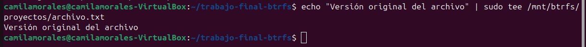
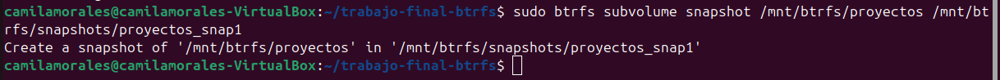
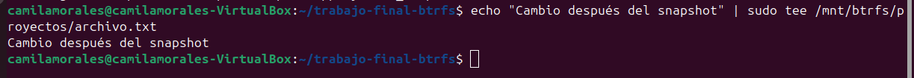
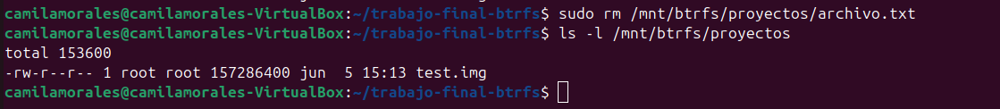
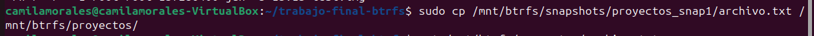
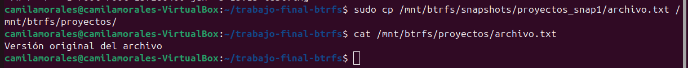
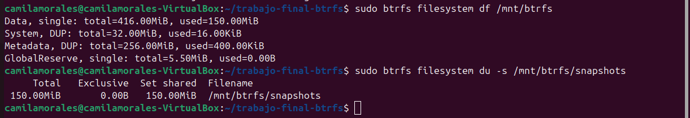

# Snapshots y Restauración

## Introducción

Una de las características más importantes de BtrFS es la capacidad de crear snapshots utilizando la tecnología Copy-on-Write (CoW).

Un snapshot representa una copia lógica del estado de un subvolumen en un instante determinado. Gracias a este mecanismo es posible recuperar información modificada o eliminada sin necesidad de realizar copias completas de los datos.

En esta sección se demuestra la creación de un snapshot, la modificación y eliminación de información, y posteriormente la restauración de los datos a partir del snapshot generado.

## Preparación del entorno

Para realizar la prueba se creó un archivo dentro del subvolumen principal de trabajo ('proyectos'):

Comando utilizado:
```bash
echo "Versión original del archivo" | sudo tee /mnt/btrfs/proyectos/archivo.txt
```



Verifico que el archivo se haya creado correctamente con el comando:

```bash
cat /mnt/btrfs/proyectos/archivo.txt
```


Resultado obtenido:

```text
Versión original del archivo
```

## Creación del Snapshot

Se creó un snapshot del subvolumen proyectos utilizando el comando: 

```bash
 sudo btrfs subvolume snapshot /mnt/btrfs/proyectos /mnt/btrfs/snapshots/proyectos_snap1
```



Resultado obtenido: 

```text
Create a snapshot of '/mnt/btrfs/proyectos' in '/mnt/btrfs/snapshots/proyectos_snap1'
```

Para verificar la existencia del snapshot se ejecutó:

```bash
sudo btrfs subvolume list /mnt/btrfs
```


Resultado Obtenido:

```text
ID 256 gen 41 top level 5 path proyectos
ID 257 gen 27 top level 5 path documentos
ID 258 gen 27 top level 5 path backups
ID 259 gen 41 top level 5 path snapshots
ID 260 gen 41 top level 259 path snapshots/proyectos_snap1
```

El sistema muestra el nuevo snapshot creado dentro del subvolumen snapshots.

## Modificación de datos después del snapshot

Una vez creado el snapshot, se modificó el archivo original agregando una nueva linea con el comando:

```bash
 echo "Cambio después del snapshot" | sudo tee /mnt/btrfs/proyectos/archivo.txt
```



Se verificó que la modificación se realizo correctamente con el comando: 

```bash
cat /mnt/btrfs/proyectos/archivo.txt
```


Resultado Obtenido:

```text
Cambio después del snapshot
```

Esto demuestra que los cambios posteriores al snapshot no afectan su estado guardado.

## Simulación de pérdida de datos

Para simular una situación real de pérdida de información se elimino el archivo con el comando:

```bash
sudo rm /mnt/btrfs/proyectos/archivo.txt
```


Se verificó que se haya eliminado con el comando:

```bash
ls -l /mnt/btrfs/proyectos
```



Resultado Obtenido:

```text
total 153600
-rw-r--r-- 1 root root 157286400 jun  5 15:13 test.img
```
Con esto se simula una pérdida de información dentro del subvolumen.

## Restauración desde el snapshot

Dado a que el snapshot conserva el estado del subvolumen al momento de su creación, fue posible recuperar el archivo eliminado copiándolo desde el snapshot.

Comando utilizado:

```bash
 sudo cp /mnt/btrfs/snapshots/proyectos_snap1/archivo.txt /mnt/btrfs/proyectos/
```



Se verificó que el archivo fue restaurado correctamente con el comando:

```bash
 cat /mnt/btrfs/proyectos/archivo.txt
```



Se puede observar que el archivo recuperado contiene únicamente la información existente al momento de crear el snapshot, demostrando que las modificaciones posteriores no afectaron la copia almacenada.

## Uso de espacio (Copy-on-Write)

Se verifica el uso de espacio del filesystem con el comando:

```bash
 sudo btrfs filesystem df /mnt/btrfs
```

Y también se analiza el uso del directorio de snapshots con el comando:

```bash
 sudo btrfs filesystem du -s /mnt/btrfs/snapshots
```


Resultados Obtenidos:

```text
Data, single: total=416.00MiB, used=150.00MiB
System, DUP: total=32.00MiB, used=16.00KiB
Metadata, DUP: total=256.00MiB, used=400.00KiB
GlobalReserve, single: total=5.50MiB, used=0.00B
```

```text
     Total   Exclusive  Set shared  Filename
 150.00MiB       0.00B   150.00MiB  /mnt/btrfs/snapshots
```

Los snapshots ocupan espacio mínimo adicional debido al mecanismo Copy-on-Write.
No se duplican los datos completos del subvolumen.

## Funcionamiendo de Copy-on-Write

BtrFS implementa la tecnología Copy-on-Write (CoW), mediante la cual los bloques originales de datos no son sobrescritos cuando se realizan modificaciones.

Gracias a este mecanismo, los snapshots pueden crearse de forma prácticamente instantánea y con un consumo mínimo de espacio inicial, ya que solamente se almacena nuevos bloques cuando los datos cambian.

Esta característica permite generar puntos de recuperación frecuentes con un impacto reducido sobre el almacenamiento disponible.

## Justificación de la prueba

La demostración fue diseñada para reproducir un escenario real de pérdida de información. En primer lugar, se crea un archivo dentro del subvolumen proyectos y posteriormente se genera un snapshot que representa el estado del sistema en ese momento.

Una vez creado el snapshot, el archivo original es modificado y posteriormente eliminado para simular una situación de error operativo o pérdida accidental de datos. Finalmente, se recupera el archivo utilizando la información almacenada en el snapshot.

Este método permite demostrar de forma práctica dos características fundamentales de BtrFS:

    * La capacidad de preservar el estado de un subvolumen en un momento determinado mediante snapshots.
    * La posibilidad de restaurar información sin recurrir a copias de seguridad tradicionales.

Además, este escenario permite observar el funcionamiento de Copy-on-Write (CoW), ya que las modificaciones realizadas después de la creación del snapshot no afectan la versión previamente almacenada.

## Conclusiones

La prueba realizada demostró que los snapshots de BtrFS permiten recuperar información eliminada o modificada de manera rápida y sencilla.

La utilización de la tecnología Copy-on-Write posibilita la creación de snapshots eficientes en términos de tiempo y espacio, convirtiéndolos en una herramienta fundamental para tareas de respaldo, recuperación ante errores y administración de sistemas.

También es posible restaurar archivos individuales desde un snapshot sin necesidad de restaurar todo el subvolumen.
