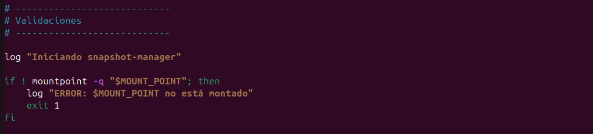
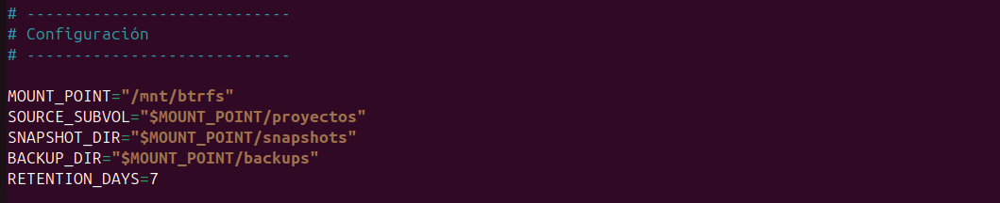
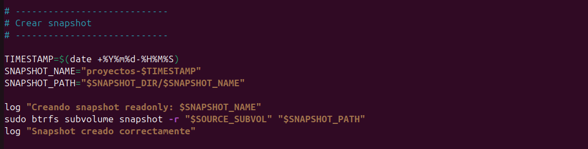
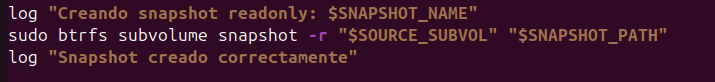
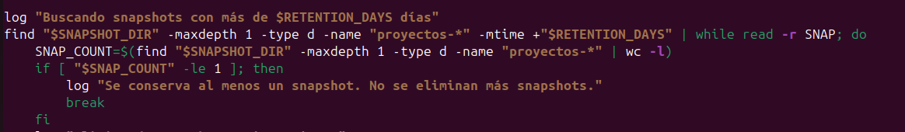
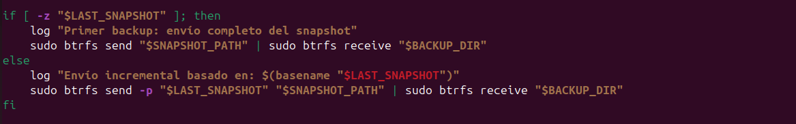
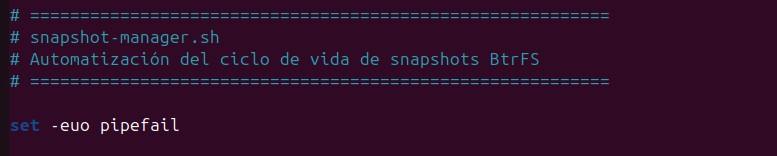
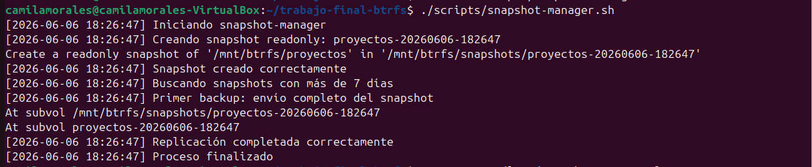
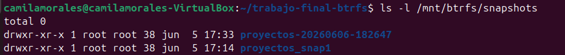
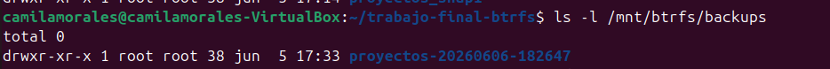

# Automatización del ciclo de vida de Snapshots

## Introducción

Una de las principales ventajas de BtrFS es la capacidad de crear snapshots de forma rápida gracias a la tecnología Copy-on-Write (CoW). Sin embargo, en entornos productivos la creación manual de snapshots resulta poco práctica y propensa a errores.

Por este motivo se desarrolló una herramienta de automatización denominada `snapshot-manager.sh`, cuyo objetivo es administrar el ciclo de vida completo de los snapshots generados sobre el subvolumen principal de trabajo.

La herramienta implementa mecanismos de creación automática de snapshots, políticas de retención y replicación mediante `btrfs send` y `btrfs receive`.

---

## Objetivos de la automatización

El script fue diseñado para cumplir las siguientes funciones:

* Crear snapshots de forma automática.
* Generar snapshots de solo lectura para garantizar la integridad de los respaldos.
* Mantener una política de retención configurable.
* Eliminar snapshots antiguos automáticamente.
* Replicar snapshots utilizando las capacidades nativas de BtrFS.
* Registrar las operaciones realizadas mediante logs.

---

## Funcionamiento del script

Durante cada ejecución se realiza los siguientes pasos:

1. Verificación de que el filesystem BtrFS se encuentre montado.
2. Comprobación de la existencia de los directorios utilizados por el sistema.
3. Creación de un snapshot de solo lectura del subvolumen `proyecos`.
4. Aplicación de una política de retención de 7 días.
5. Eliminación automática de snapshots vencidos.
6. Replicación del snapshot hacía el subvolumen `backups`.
7. Registro de todas las operaciones realizadas.

---

## Estructura del script

El script `snapshot-manager.sh` fue desarrollado para automatizar el ciclo de vida de los snapshots dentro del filesystem BtrFS.

La herramienta implementa mecanismos de validación, creación automática de snapshots, retención de información y replicación utilizando funcionalidades nativas del sistema de archivos.

A continuación se analizan las secciones más importantes del script y su relación con los requisitos planteados en la consigna:

---

### Validación previa

Antes de realizar cualquier operación, el script verifica que el filesystem BtrFS se encuentre montado correctamente.



Esta validación evita errores operativos e impide ejecutar acciones sobre rutas inexistentes o sistemas de archivos incorrectos.

---

### Configuración de variables



Estas variables definen:

* dónde está montado BtrFS
* qué subvolumen se respalda
* dónde se guardan snapshots
* dónde se almacenan backups
* cuánto tiempo se conservan snapshots

Esto permite modificar el comportamiento sin cambiar el código.

---

### Automatización de snapshots

Esta sección implementa la creación automática de snapshots de solo lectura.



El uso de marcas de tiempo (timestamps) permite generar nombres únicos para cada snapshot, facilitando la administración y el historial de puntos de recuperación.

Este bloque cumple el requisito principal de la consigna relacionado con la automatización de la creación de snapshots.

---

#### ¿Por qué utilizar snapshots de solo lectura?

Los snapshots generados por la herramienta se crean utilizando la opción `-r`:

```bash
sudo btrfs subvolume snapshot -r "$SOURCE_SUBVOL" "$SNAPSHOT_PATH"
```



Esto crea snapshots de solo lectura (readonly), evitando modificaciones accidentales sobre los puntos de recuperación generados.

Las ventajas de los snapshots readonly incluyen:

* Garantizar la integridad de la información respaldada.
* Evitar alteraciones involuntarias por parte de usuarios o procesos.
* Ser un requisito para determinadas operaciones de replicación mediante `btrfs send`.
* Facilitar la implementación de estrategias de respaldo consistentes.

Por estas razones, los snapshots readonly se consideran una práctica recomendada en entornos productivos basados en BtrFS.

---

### Retención automática

La consigna solicita un script capaz de administrar el ciclo de vida de los snapshots.

Para cumplir este requisito se implementó una política de retención de 7 días definida mediante la variable. 

```text
RETENTION_DAYS=7
```





Durante cada ejecución se identifican snapshots cuya antigüedad supera dicho valor. Los snapshots vencidos son eliminados automáticamente para evitar el crecimiento indefinido del almacenamiento utilizado por los puntos de recuperación.

Además, el script garantiza que siempre permanezca al menos un snapshot disponible, evitando la eliminación completa del historial de recuperación.

Es decir, este bloque busca snapshots antiguos, los filtra por antigüedad y elimina los que superan los días definidos

---

### Replicación de snapshots

Otra funcionalidad solicitada consiste en la utilización de `btrfs send` y `btrfs receive`.

BtrFS implementa un mecanismo de replicación nativo basado en la transmisión de cambios entre snapshots.

El comando:

```bash
btrfs send "$SNAPSHOT_PATH"
```

genera un flujo de datos que representa el contenido de un snapshot.

Mientras que el comando: 

```bash
btrfs receive "$BACKUP_DIR"
```

Reconstruye dicho snapshot en un destino remoto o local.

Cuando existe un snapshot previo, es posible utilizar transferencias incrementales mediante la opción -p, enviando únicamente los bloques modificados desde el último snapshot.

Esta característica reduce significativamente:

* El tráfico de datos.
* El tiempo de respaldo.
* El espacio utilizado durante la replicación.

Por este motivo, `btrfs send` y `btrfs receive` constituyen una de las herramientas más potentes de BtrFS para estrategias de backup y recuperación ante desastres.



Esta característica permite transferir snapshots completos o incrementales hacia otro destino, conservando la estructura interna del filesystem.

En este trabajo se utilizó para replicar automáticamente los snapshots hacia el subvolumen `backups`.

---

### Registro de eventos

Todas las operaciones realizadas por el script son registradas en archivos de log.


Se implemento una función de logging que:

* registra eventos con fecha y hora
* guarda salida en archivo
* muestra salida en consola

Esta característica facilita las tareas de auditoria, diagnóstico y seguimiento de errores, aportando características propias de herramientas utilizadas en entornos productivos.

---

### Robustez de la implementación

El script utiliza:

```text
set -euo pipefail
```



Esta configuración fuerza la finalización inmediata ante errores, evita el uso de variables no definidas y detecta fallos dentro de pipelines.

Su utilización mejora la confiabilidad de la herramienta y reduce la posibilidad de ejecutar operaciones inconsistentes sobre el filesystem.

---

## Ejecución del script

Comando utilizado:

```bash
./scripts/snapshot-manager.sh
```



 Salida Obtenida:
 
```text
[2026-06-06 18:26:47] Iniciando snapshot-manager
[2026-06-06 18:26:47] Creando snapshot readonly: proyectos-20260606-182647
Create a readonly snapshot of '/mnt/btrfs/proyectos' in '/mnt/btrfs/snapshots/proyectos-20260606-182647'
[2026-06-06 18:26:47] Snapshot creado correctamente
[2026-06-06 18:26:47] Buscando snapshots con más de 7 días
[2026-06-06 18:26:47] Primer backup: envío completo del snapshot
At subvol /mnt/btrfs/snapshots/proyectos-20260606-182647
At subvol proyectos-20260606-182647
[2026-06-06 18:26:47] Replicación completada correctamente
[2026-06-06 18:26:47] Proceso finalizado
```

## Verificación del snapshot generado

Para verificar la creación del snapshot se ejecutó:

```bash
ls -l /mnt/btrfs/snapshots
```



Salida obtenida:

```text
proyectos-20260606-182647
proyectos_snap1
```
El sistema muestra el nuevo snapshot generado automáticamente por la herramienta.

## Verificación de la replicación

Para comprobar la transferencia mediante `btrfs send` y `btrfs receive` se ejecutó:

```bash
ls -l /mnt/btrfs/backups
```



Salida obtenida:

```text
proyectos-20260606-182647
```

La presencia del snapshot dentro del subvolumen `backups` confirma que la replicación se realizó correctamente.

## Registro de eventos

El script almacena información de ejecución en:

```text
reportes/logs/snapshot-manager.log
```

Por ejemplo:

```text
[2026-06-06 18:26:47] Snapshot creado correctamente
[2026-06-06 18:26:47] Replicación completada correctamente
```

Estos registros permiten realizar tareas de auditoría y diagnóstico ante posibles fallos.

## Beneficios de la automatización

La automatización reduce significativamente la intervención manual del administrador y permite implementar estrategias de protección de datos de manera consistente.

La utilización de snapshots de solo lectura junto con mecanismos de retención y replicación proporciona una solución eficiente ante errores y la preservación de información dentro de entornos basados en BtrFS.

## Conclusiones

La herramienta desarrollada permite automatizar el ciclo de vida de los snapshots en BtrFS, eliminando la necesidad de realizar tareas manuales de administración.

La combinación de snapshots readonly, políticas de retención y replicación mediante btrfs send y btrfs receive proporciona una solución adecuada para entornos donde se requiere protección de datos y capacidad de recuperación ante fallos.

Además, el uso de transferencias incrementales permite aprovechar una de las funcionalidades más potentes de BtrFS, optimizando el uso de recursos y reduciendo los tiempos de respaldo.
