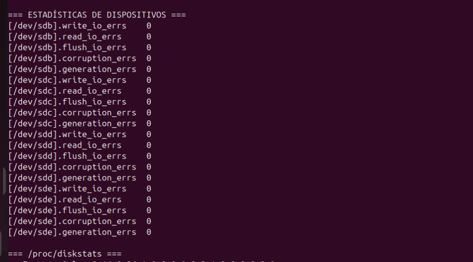
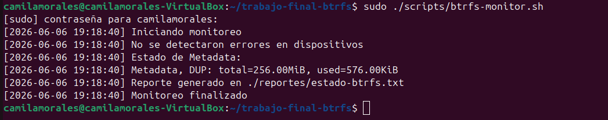
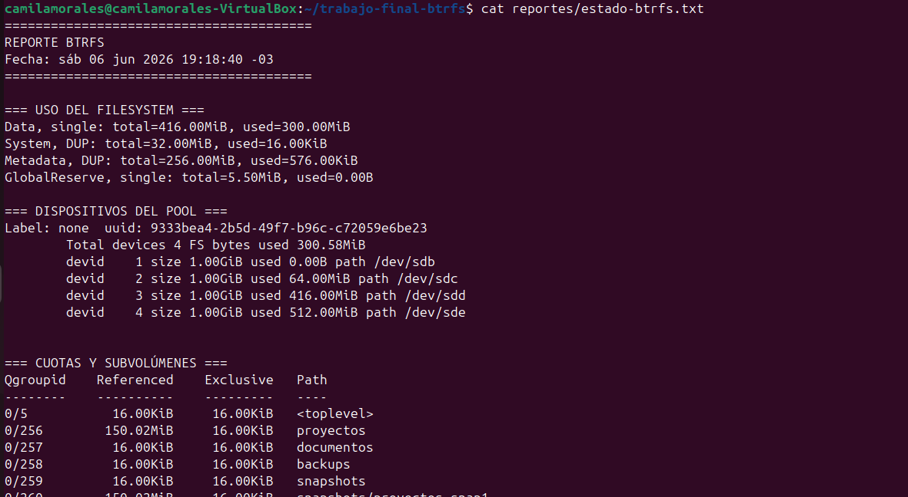
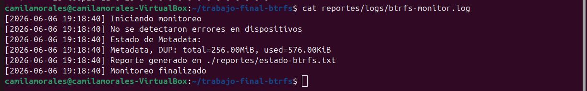

# Monitoreo y Observabilidad del Sistema de Archivos BtrFS

## Introducción

BtrFS presenta una forma particular de gestionar el almacenamiento, separando internamente el uso de espacio en **Data, Metadata y System chunks**.

Esto puede generar interpretaciones incorrectas al utilizar herramientas tradicionales como `df -h`, ya que estas no reflejan el estado real del filesystem.

Por este motivo, se implementó una solución de monitoreo que permite obtener una visión más precisa del estado del sistema de archivos.

---

## Objetivo

El objetivo del script `btrfs-monitor.sh` es proporcionar un sistema de observabilidad del filesystem BtrFS que permita:

* Monitorear el uso real de Data y Metadata.
* Visualizar el estado del filesystem multidevice.
* Analizar estadísticas del kernel.
* Detectar errores en los dispositivos del pool.
* Generar reportes y logs persistentes.

---

## ¿Por qué no es suficiente utilizar df -h?

En sistemas de archivos tradicionales, herramientas como `df -h` suelen ser suficientes para conocer el estado del almacenamiento.

Sin embargo, BtrFS administra el espacio mediante la asignación de chunks independientes para:

* Data
* Metadata
* System

Por este motivo, es posible que `df -h` indique que existe espacio disponible mientras que alguno de los pools internos (especialmente Metadata) se encuentre próximo a agotarse.

El comando:

```bash
sudo btrfs filesystem df /mnt/btrfs
```

permite observar esta distribución interna y constituye una fuente de información mucho más precisa para tareas de administración y diagnóstico.

---

## Funcionamiento del script

El script realiza las siguientes acciones:

1. Verifica que el filesystem esté montado.
2. Genera un reporte del estado del sistema.
3. Muestra el uso de Data, Metadata y System chunks.
4. Lista los dispositivos del pool BtrFS.
5. Consulta cuotas y subvolúmenes.
6. Captura estadísticas del kernel Linux.
7. Detecta posibles errores en dispositivos.
8. Registra toda la información en logs.

---

## Estructura del script

El script fue diseñado para recopilar información relevante sobre el estado del filesystem BtrFS y generar reportes que faciliten las tareas de monitoreo y administración.

Su funcionamiento se basa en la ejecución de comandos nativos de BtrFS y la recolección de estadísticas del sistema operativo, permitiendo centralizar la información en archivos de reporte y logs.

---

## Monitoreo del filesystem

El monitoreo del uso interno del filesystem se realiza mediante:

```bash
sudo btrfs filesystem df "$MOUNT_POINT"
```


Este comando permite visualizar el uso interno del filesystem separado en:

* Data chunks
* Metadata chunks
* System chunks

Esto es fundamental en BtrFS, ya que el espacio no se gestiona de forma unificada como en otros sistemas de archivos.

---

## Estado de dispositivos

Para consultar el estado de los dispositivos que forman parte del pool BtrFS se utiliza:

```bash
sudo btrfs device stats "$MOUNT_POINT"
```


Este comando permite obtener estadística de los dispositivos que forman parte del pool BtrFS. 

Se utiliza para detectar errores de escritura y corrupción de datos.

### Estado observado en el entorno de pruebas

Durante la ejecución del script se detectaron cuatro dispositivos activos dentro del pool BtrFS:

* /dev/sdb
* /dev/sdc
* /dev/sdd
* /dev/sde

Todos los dispositivos reportaron:

* `write_io_errs = 0`
* `read_io_errs = 0`
* `corruption_errs = 0`
* `generation_errs = 0`



Esto indica que el pool se encontraba funcionando correctamente al momento de la prueba.

---

## Estadísticas del sistema

El script también recopila información del kernel Linux mediante:

```bash
cat /proc/diskstats
```


Este archivo del kernel Linux contiene estadísticas de actividad de los discos físicos. Además, permite completar el monitoreo del filesystem con información a nivel de sistema operativo.

---

## Ejecución del script

El script se ejecuto con el comando: 


```bash
sudo ./scripts/btrfs-monitor.sh
```



El script debe ejecutarse con permisos de administrador para garantizar acceso completo a la información del filesystem y de los dispositivos, ya que el script `btrfs-monitor.sh` interactúa con elementos del sistema que requieren privilegios de administrador para acceder o modificar.

Resultado obtenido:

```text
[2026-06-06 19:18:40] Iniciando monitoreo
[2026-06-06 19:18:40] No se detectaron errores en dispositivos
[2026-06-06 19:18:40] Estado de Metadata:
[2026-06-06 19:18:40] Metadata, DUP: total=256.00MiB, used=576.00KiB
[2026-06-06 19:18:40] Reporte generado en ./reportes/estado-btrfs.txt
[2026-06-06 19:18:40] Monitoreo finalizado
```

La salida confirma que el monitoreo se ejecutó correctamente, generando tanto el reporte detallado como el registro de eventos en el archivo de logs.

---

## Reporte generado

El script genera un archivo con información detallada del sistema:

```text
reportes/estado-btrfs.txt
```



Ejemplo del contenido:

```text
=== USO DEL FILESYSTEM ===
Data, single: total=416.00MiB, used=300.00MiB
System, DUP: total=32.00MiB, used=16.00KiB
Metadata, DUP: total=256.00MiB, used=576.00KiB
GlobalReserve, single: total=5.50MiB, used=0.00B
```

### Interpretación de los resultados

Los datos obtenidos muestran que:

* El filesystem tiene asignados 416 MiB para almacenamiento de datos.
* De ese espacio, aproximadamente 300 MiB se encuentran utilizados.
* Los metadatos consumen únicamente 576 KiB, por lo que existe un amplio margen disponible para la administración interna del filesystem.
* El bloque System ocupa una cantidad mínima de espacio, ya que contiene únicamente información estructural necesaria para el funcionamiento del sistema de archivos.

Estos valores permiten verificar que el filesystem se encuentra en condiciones normales de operación y sin presión sobre los recursos internos.

El reporte generado permite visualizar en un único archivo el estado interno del filesystem, incluyendo:

* Uso de Data y Metadata chunks.
* Información de los dispositivos del pool.
* Cuotas configuradas.
* Estadísticas del sistema.
* Estado de los dispositivos BtrFS.

Esta información resulta especialmente útil para comprender cómo BtrFS administra el espacio de almacenamiento interno.

---

## Detección automática de errores

El script incorpora una verificación automática sobre las estadísticas de los dispositivos mediante:

```bash
sudo btrfs device stats /mnt/btrfs
```


Se analizan los siguientes contadores:

* `write_io_errs`
* `read_io_errs`
* `flush_io_errs`
* `corruption_errs`
* `generation_errs`


Cuando alguno de estos valores es distinto de cero, el script genera una alerta indicando la existencia de posibles problemas en los dispositivos que integran el pool.

Durante las pruebas realizadas no se detectaron errores, obteniéndose el siguiente resultado:

```text
[2026-06-06 19:18:40] No se detectaron errores en dispositivos
```


Esta funcionalidad constituye un mecanismo básico de observabilidad que permite identificar fallas potenciales antes de que afecten la integridad de los datos almacenados.

---

## Integración con estadísticas del kernel

Además de las herramientas nativas de BtrFS, el script recopila información desde:

```bash
/proc/diskstats
```

Este archivo virtual del kernel Linux contiene estadísticas de actividad de los dispositivos de bloque, incluyendo:

* Lecturas realizadas.
* Escrituras realizadas.
* Sectores transferidos.
* Tiempo de actividad de entrada/salida (E/S).

La incorporación de esta información permite complementar la observabilidad del filesystem con métricas de bajo nivel provenientes directamente del sistema operativo.

---

## Logs del sistema

El monitoreo también genera logs persistentes en:

```text
reportes/logs/btrfs-monitor.log
```




### Ejemplo de log generado

```text
[2026-06-06 19:18:40] Iniciando monitoreo
[2026-06-06 19:18:40] No se detectaron errores en dispositivos
[2026-06-06 19:18:40] Estado de Metadata:
[2026-06-06 19:18:40] Metadata, DUP: total=256.00MiB, used=576.00KiB
[2026-06-06 19:18:40] Reporte generado en ./reportes/estado-btrfs.txt
[2026-06-06 19:18:40] Monitoreo finalizado
```

Los logs permiten mantener un historial de ejecuciones y facilitan tareas de auditoría, diagnóstico y seguimiento del estado del filesystem a lo largo del tiempo.

---

## Consideraciones sobre el entorno multidevice

El filesystem fue configurado utilizando múltiples dispositivos agregados mediante el comando `btrfs device add` y posteriormente reorganizados mediante `btrfs balance`.

No se utilizó RAID explícito, sino un entorno multidevice administrado directamente por BtrFS.

Por este motivo, el monitoreo se centra en el estado de los dispositivos que integran el pool y en la administración interna del espacio realizada por BtrFS.

---

## Conclusión

La solución implementada permite observar el comportamiento interno de un filesystem BtrFS multidevice mediante la integración de:

* Métricas de uso de espacio (Data y Metadata).
* Estado de los dispositivos del pool.
* Estadísticas del kernel Linux.
* Detección automática de errores.
* Registro de logs para auditoría.

Este enfoque proporciona una visión más precisa del estado del sistema en comparación con herramientas tradicionales como `df -h`, y permite realizar un seguimiento adecuado del funcionamiento del filesystem, facilitando las tareas de administración, monitoreo y diagnóstico.

